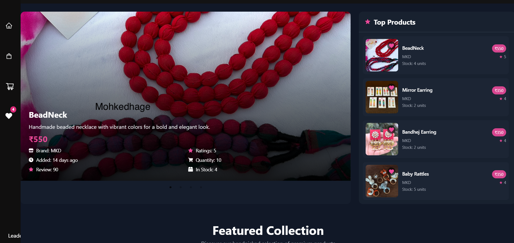
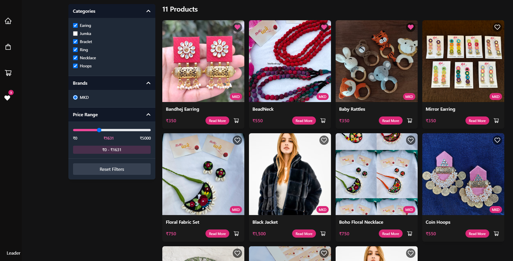
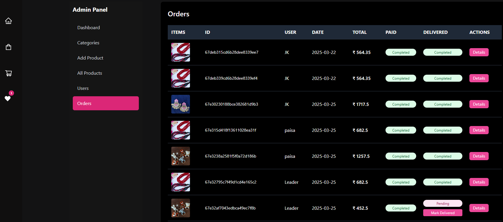
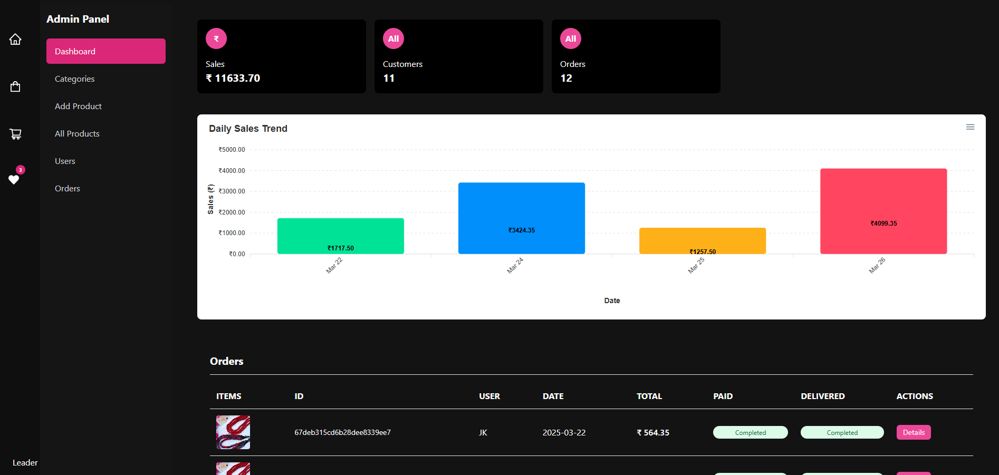

# Mohke Dhage - Handmade & Fabric Jewelry eCommerce Website

## Overview
Mohke Dhage is a full-featured eCommerce website built using the MERN stack. It specializes in selling handmade and fabric jewelry, providing an interactive and responsive shopping experience.

## Features
- **User-Friendly Interface:** Intuitive and engaging UI/UX for seamless navigation.
- **Product Management:** Admin dashboard to add, update, and delete products.
- **Secure Authentication:** User registration and login with JWT authentication.
- **Cart & Checkout:** Add items to the cart, review orders, and make payments.
- **Search & Filtering:** Advanced search and filtering options for easy product discovery.
- **Responsive Design:** Fully optimized for desktop and mobile devices.
- **Deployment:** Hosted on Vercel for fast and reliable performance.

## Tech Stack
- **Frontend:** React.js, Redux, Tailwind CSS
- **Backend:** Node.js, Express.js, MongoDB
- **Authentication:** JWT-based authentication
- **Deployment:** Vercel (Frontend), Render (Backend)

## Website Preview  
Here’s a preview of the website interface:  

  
  
  
  

## Live Preview  
Check out the live version of Mohke Dhage here (viewe on laptop/desktop):  
🔗 [Mohke Dhage](https://mohkedhage.vercel.app/)

## Contributing  
Contributions are welcome! Feel free to fork the repository and submit a pull request.

## License  
This project is licensed under the MIT License.

---

For any queries or feedback, reach out to us. Happy Shopping! 🛍️
